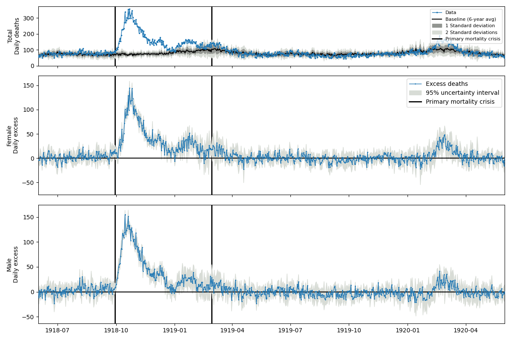
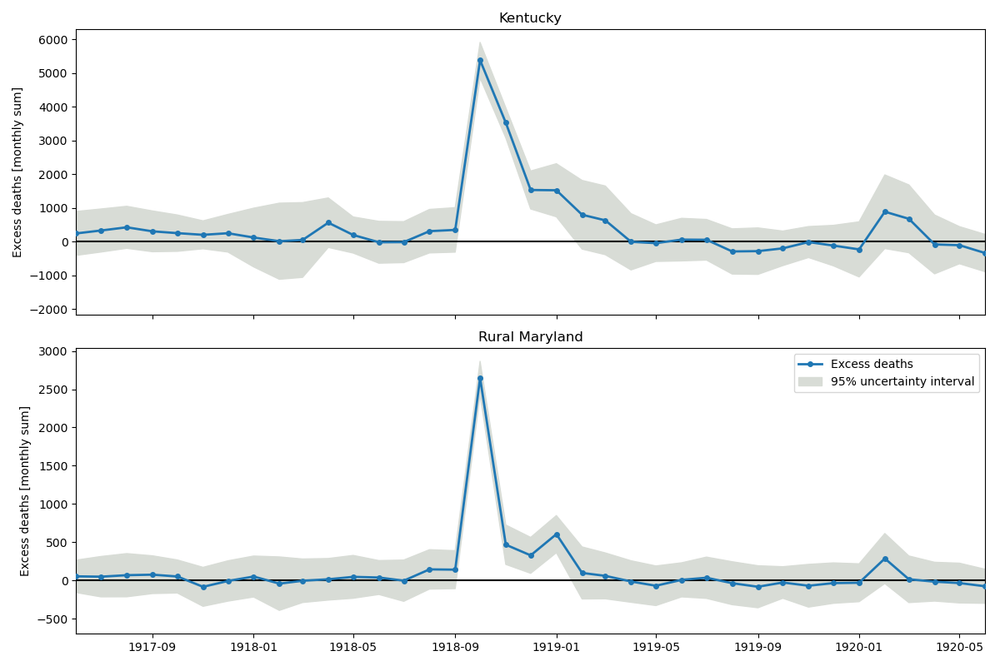
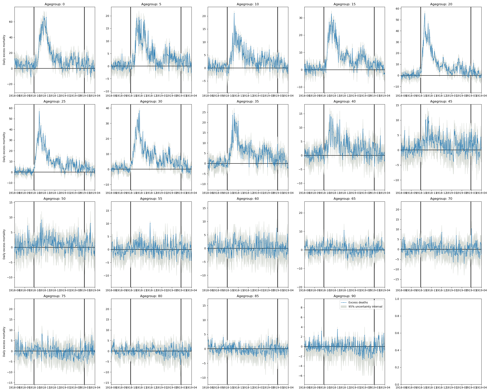
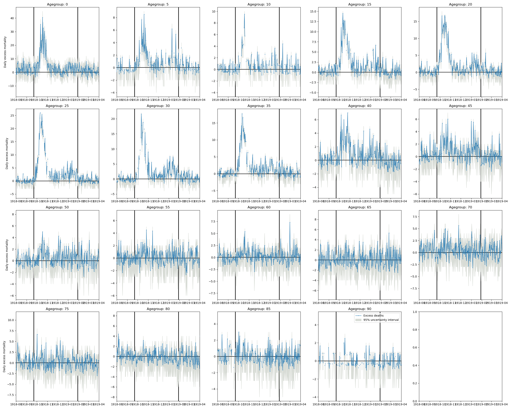
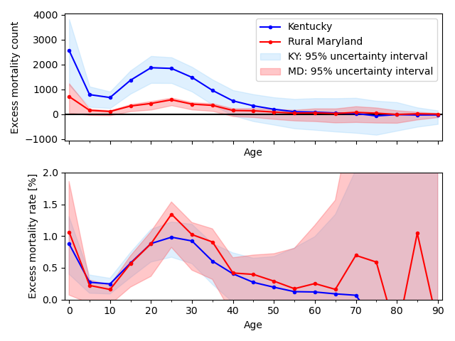
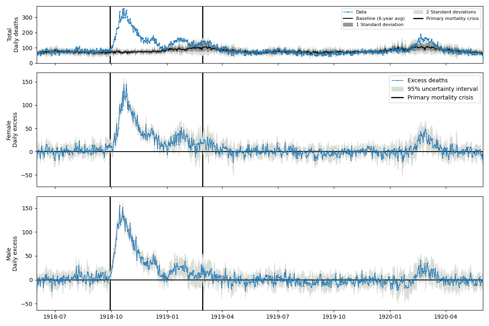
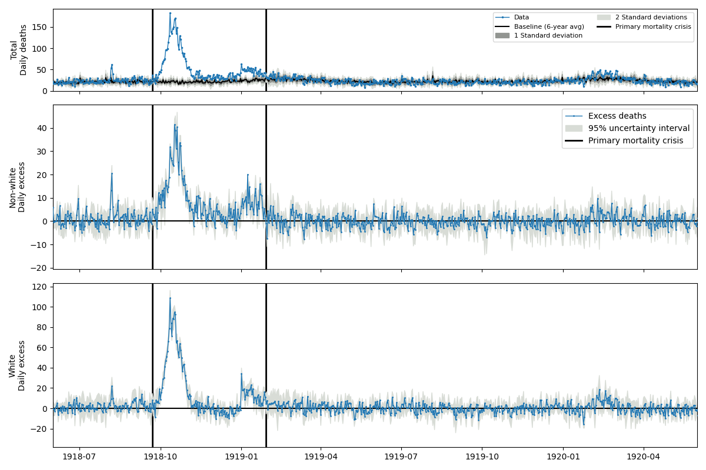
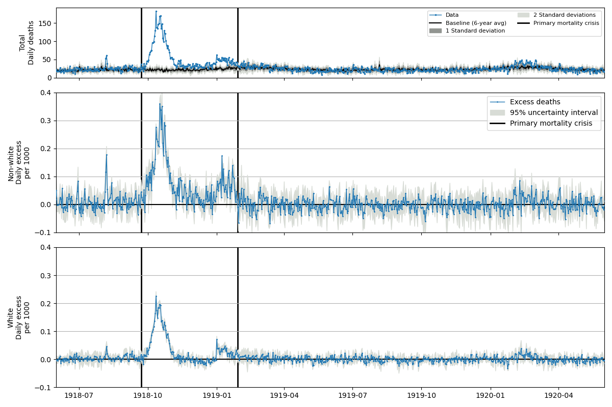

# 1EME Contribution, Rasmus Kristoffer Pedersen

My contribution to the 1EME project, organised by Hampton Gaddy and Eric Schneider (LSE)

More info on the project, see https://www.lse.ac.uk/economic-history/hed/workshops/one-epidemic-many-estimates-1eme 

Analysis by Rasmus Kristoffer Pedersen.
- Institute of Epidemiology and Social Medicine, University of Münster, Germany
- IMMIDD, University of Münster, Germany

# Overview
To determine the six quantities of interest, I made use of a methodology previously developed to identify mortality crises in a similar dataset of all-cause mortality. 
The methods are published in Pedersen et al, AJE, 2025, in which daily all-cause mortality for Denmark between 1815 and 1915 is analyzed. (See doi.org/10.1093/aje/kwae187 for details)
A python repository implementing the previously used methods is available on github.com/pandemixcenter/ExcessMortalityFunctions/. 
Only minor modifications of the code (for compability with a new Python version) was necessary to carry out the present analysis. 
For consistency in the results, all analysis (except for quantity 4) was done on a daily time-resolution. For monthly estimates, sums of the results on daily time-resolution were used. Similar analysis could be done using data on weekly, monthly or annual time-resolution with the same code.

I have chosen to keep the methodology used very comparable to the one used in my previous work, rather than analyze the results thoroughly and calibrate the method to the data. This was done in part due to time-constraints, but also in order to keep the method close to that used previously and to test how accurate the methods implemented in the ExcessMortalityFunctions can produce useful results for a new dataset without modification. 
Code and figures are available on github: github.com/rasmuspedersen1992/1EME

Details of the methodology used are given below.

# Establishing a mortality baseline, state-level
An initial baseline of mortality for any given date is first determined by calculating the mean of the same date in the surrounding $x$ years. For this analysis, I use $x=\pm3$ for both states for consistency, due to the limited period available in the data for rural Maryland. That is, the baseline on September 10th, 1919 is the average of September 10th in the years 1916, 1917, 1918, 1920, 1921, and 1922. 
The empirical standard deviation of the same years is also calculated. 
An iterative process is then carried out: Any date where the observed data lies more than three standard deviations away from the baseline is omitted and the baseline (and standard deviation) is recalculated. This process is repeated until no days exceed this threshold. 
This iterative process ensures that days of high (assumed excess) mortality do not affect the baseline in surrounding years.

# Identifying mortality crises
From the resulting mortality baseline, I identify mortality crises, that is, continuous periods of excessive mortality. 
In this analysis, I define a mortality crisis as any period of time when the daily mortality exceeds the baseline with three standard deviations at least once. Periods are connected if the excess mortality does not drop below two standard deviations for more than seven days. 
This allows me to estimate a distinct start- and end-days of any mortality crisis. 
Excess deaths are determined as the difference between the total mortality observed during this period and the sum of expected mortality (i.e. the baseline) during the same period. Uncertainty intervals are calculated similarly as the difference between the observed mortality and the baseline plus/minus two standard deviations.
The primary pandemic period was identified from state-level daily data. The identified period was used in the analysis for quantities 3, 5, and 6. 

# Additional details
## Quantity 1
Only mortality during the primary mortality crisis is reported.
The period identified is 1918-09-29 to 1919-02-28 for Kentucky, and 1918-09-22 to 1919-01-29 for Maryland.

## Quantity 2
The reported estimates are monthly-aggregated sums of all identified mortality crises in the period given in the reporting sheet. Days without mortality crises do not contribute to estimated pandemic deaths. 
Two alternative methods could have been used with the same code instead: Summing up the excess mortality of Quantity 1 by month (rather than full mortality crisis), or by calculating excess mortality on a monthly basis directly, reporting excess for all months. This would have resulted in a lower or higher estimate respectively. In a more thorough analysis, the results of all three methods could be compared and analyzed.

## Quantity 3:
Due to low counts, I instead assume Poisson distribution of data, and calculate the excess over the full period. Uncertainty estimates are based on the 95% confidence interval of the estimated (Poisson-distribution) baseline. The reported estimates are the sum of the excess during the period identified for quantity 1.

## Quantity 4:
Due to very low counts in some counties, I carried out a county-specific analysis of the data aggregated by week, and subsequently determined mortality crises on weekly level.
Rather than only report deaths during the primary mortality crisis in the county, I took the sum of all mortality crisis that occured between 1918-03-01 and 1921-05-01 (the period considered in the reporting sheet for quantity 2), to ensure that even counties where only a few deaths occurred during the pandemic would have an estimate. 

## Quantity 5 and 6:
Excess mortality was determined for each of the subgroups, and the sum of the excess in the primary pandemic period (as identified for quantity 1) was reported.

# Figures
To verify if my results seems reasonable, I made a couple of figures. 
They are shown here below:

#### Daily mortality on state-level with the identificed mortality crises highlighted (Quantity 1)

#### Excess mortality on state-level, summed by month(Quantity 2)

#### Excess mortality by age-group (Quantity 3)

Kentucky:

Rural Maryland:

Total deaths by age:

#### Excess mortality by subgroups (Quantity 5 and 6)

Because the difference in deaths per capita were rather noticeable in rural Maryland, I also made a figure with deaths per 1,000 capita highlighting the difference:

